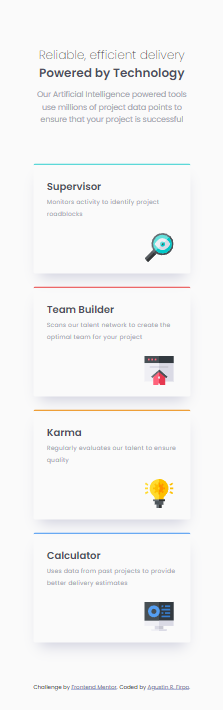

# Frontend Mentor - Four card feature section solution

This is a solution to the [Four card feature section challenge on Frontend Mentor](https://www.frontendmentor.io/challenges/four-card-feature-section-weK1eFYK). Frontend Mentor challenges help you improve your coding skills by building realistic projects. 

## Table of contents

- [Overview](#overview)
  - [The challenge](#the-challenge)
  - [Screenshot](#screenshot)
  - [Links](#links)
- [My process](#my-process)
  - [Built with](#built-with)
  - [What I learned](#what-i-learned)
  - [Continued development](#continued-development)
  - [Useful resources](#useful-resources)
- [Author](#author)

## Overview

### The challenge

Users should be able to:

- View the optimal layout for the site depending on their device's screen size

### Screenshot

### Links

- Solution URL: [Solution-Github Repository](https://github.com/Arfirpo/four-card-feature-section-master/)
- Live Site URL: [Solution-Github PAge](https://arfirpo.github.io/four-card-feature-section-master/)

## My process

### Built with

- Semantic HTML5 markup
- CSS custom properties
- Css media queries
- Position absolute/relative
- Mobile-first workflow

### What I learned

This challenge served me to review previously incorporated basic concepts and mainly to reinforce knowledge about the use of absolute and relative position, which was fundamental to determine the place of cards in desktop design

### Continued development

Regarding the tools used in this challenge, I would like to expand my handling of breakpoints along with display flex and grid to give more dynamism to my responsive designs

### Useful resources

- [Box Shadow CSS Generator](https://cssgenerator.org/box-shadow-css-generator.html) - this page helped me, especially visually, to model my shadow box.

## Author

- Website - [Linkedin](https://www.linkedin.com/in/agustin-rodrigo-firpo-0aa86697/)
- Frontend Mentor - [@Arfirpo](https://www.frontendmentor.io/profile/Arfirpo)
